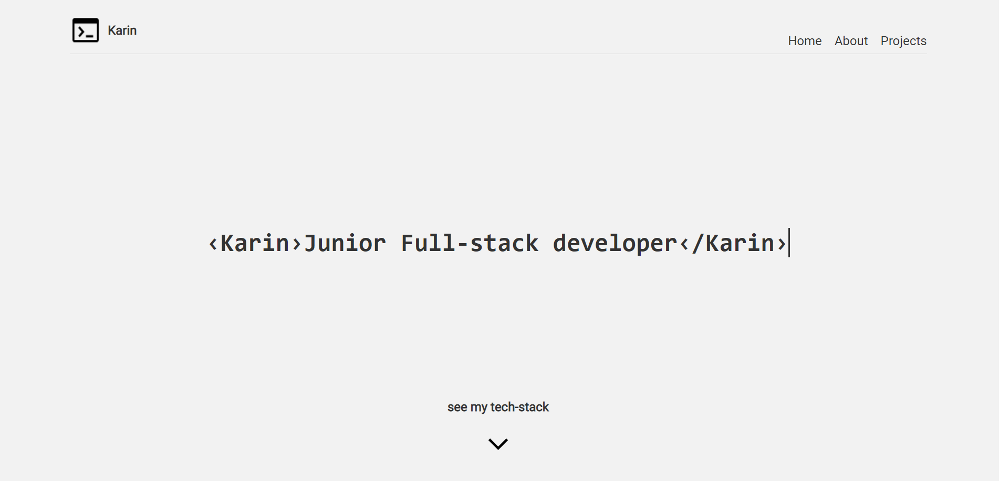
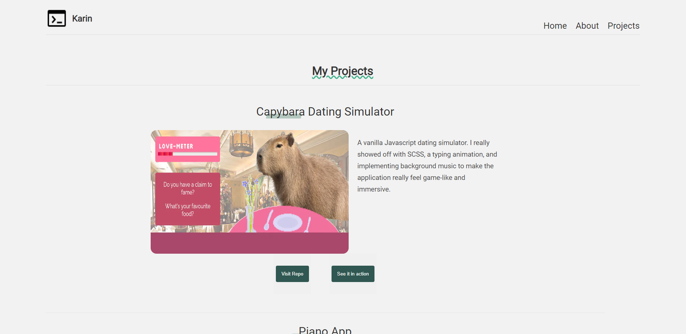

# portfolio

<h1><a href="https://karin-hawksworth.vercel.app/">Visit Website<a/></h1>

## Table of Contents
- [About](#about)
- [Screenshots](#screenshots)
- [Languages](#languages)
- [Code of Note](#code_of_note)

## About 

My website portfolio built with NextJS and Firebase. Here is where I introduce myself, my tech stack, and a sample of some of my projects. The projects page pulls from a database I created with firebase. This was my first time using NextJS and implementing firebase. I experimented using global scss and module scss, and with keyframe animations. Also my first time using env variables for security.

## Screenshots 

## Languages 

- NextJS
- SCSS
- Firebase (Firestore Database)

## Code of Note 

- a 404 page which is set to a timeout function which redirects the user back to the homepage
- linking the firebase database with my application

